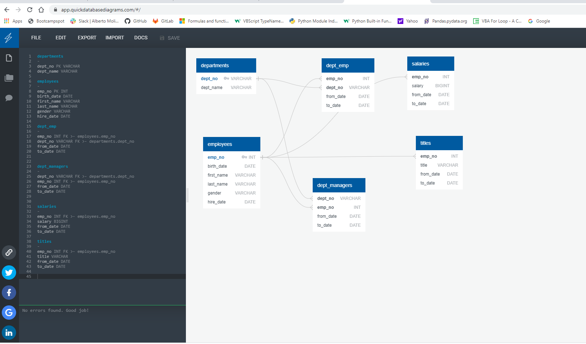

# SQL Homework - Employee Database: A Mystery in Two Parts

## Overview

It is a beautiful spring day, and it is two weeks since you have been hired as a new data engineer at Pewlett Hackard. Your first major task is a research project on employees of the corporation from the 1980s and 1990s. All that remain of the database of employees from that period are six CSV files.

#### Data Modeling

Created and built the Entity Relationship Diagram (ERD) based on the provide csv files. The provided  database graphical representation of the the main tables departments and employees table relates to the rest of tables. 
 

 
#### Data Engineering

* Created the table schema for each of the six CSV files and specified data types, primary keys, foreign keys, and other constraints.
* The primary keys  are checked and the columns are unique and took the primary keys in order to uniquely identify a row.
* Created tables in the correct order to handle foreign keys.
* Imported the six CSV files into the corresponding SQL tables.  

#### Data Analysis

* Listed the following details of each employee: employee number, last name, first name, sex, and salary.
* Listed first name, last name, and hire date for employees who were hired in 1986.
* Listed the manager of each department with the following information: department number, department name, the manager's employee number, last name, first name.
* Listed the department of each employee with the following information: employee number, last name, first name, and department name.
* Listed first name, last name, and sex for employees whose first name is "Hercules" and last names begin with "B."
* Listed all employees in the Sales department, including their employee number, last name, first name, and department name.
* Listed all employees in the Sales and Development departments, including their employee number, last name, first name, and department name.
* Listed in descending order, list the frequency count of employee last names, i.e., how many employees share each last name

## Bonus (Optional)

Jupyter Notebook of the bonus analysis.

 

## Output

* Create an image file of your ERD.
* Create a `.sql` file of your table schemata.
* Create a `.sql` file of your queries.
* (Optional) Create a Jupyter Notebook of the bonus analysis.

## References

http://www.quickdatabasediagrams.com](http://www.quickdatabasediagrams.com)
https://en.wikipedia.org/wiki/Compound_key
https://docs.sqlalchemy.org/en/latest/core/engines.html#postgresql
https://docs.sqlalchemy.org/en/latest/core/engines.html#postgresql
https://www.youtube.com/watch?v=2uaTPmNvH0I
